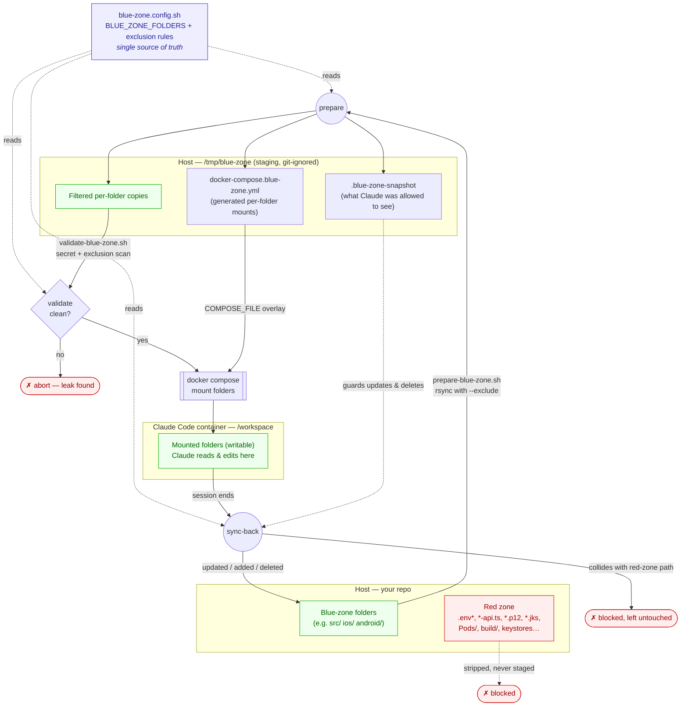

# Blue Zone Flow

How a project's files move through the blue-zone pipeline — from the repo on the
host, through the filtered staging copy, into Claude's container, and back. The
folder set and exclusion rules come entirely from
[`blue-zone.config.sh`](../blue-zone.config.sh); every stage below reads from it,
so nothing hardcodes `src/ios/android`.

## Stages

| Stage | Script | What happens |
|-------|--------|--------------|
| **Configure** | `blue-zone.config.sh` | Declares `BLUE_ZONE_FOLDERS` and the common + per-folder exclusion rules. The only file you edit to adapt to a project. |
| **Prepare** | `prepare-blue-zone.sh` | `rsync`s each configured folder into `/tmp/blue-zone/`, stripping red-zone files. Writes the snapshot and generates the docker-compose mount overlay. |
| **Validate** | `validate-blue-zone.sh` | Confirms every configured exclusion held and scans for hardcoded secrets. A leak aborts the run before anything is mounted. |
| **Mount & run** | `start-cli.sh` / `run-headless.sh` | Layers the generated overlay onto `docker-compose.yml` via `COMPOSE_FILE` and starts Claude Code with only the blue-zone folders mounted (writable). |
| **Sync back** | `sync-back.sh` | Copies Claude's changes into the repo. The snapshot lets it update/delete only files Claude was allowed to see; a new file whose path collides with a stripped red-zone file is blocked. |

Red-zone files are never staged, never mounted, and never overwritten by
sync-back — they stay in the repo untouched throughout.
