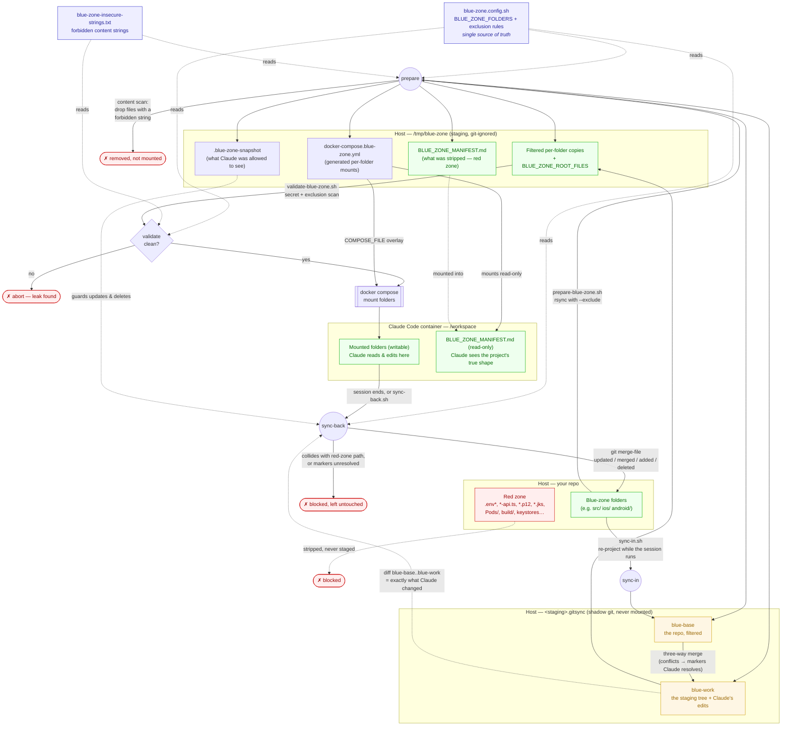

# Blue Zone Flow

How a project's files move through the blue-zone pipeline — from the repo on the
host, through the filtered staging copy, into Claude's container, and back. The
folder set and exclusion rules come entirely from
[`blue-zone.config.sh`](../blue-zone.config.sh); every stage below reads from it,
so nothing hardcodes `src/ios/android`.

```mermaid
flowchart TD
    cfg["blue-zone.config.sh<br/>BLUE_ZONE_FOLDERS + exclusion rules<br/><i>single source of truth</i>"]

    subgraph host["Host — your repo"]
        blue["Blue-zone folders<br/>(e.g. src/ ios/ android/)"]
        red["Red zone<br/>.env*, *-api.ts, *.p12, *.jks,<br/>Pods/, build/, keystores…"]
    end

    subgraph stage["Host — /tmp/blue-zone (staging, git-ignored)"]
        staged["Filtered per-folder copies<br/>+ BLUE_ZONE_ROOT_FILES"]
        snap[".blue-zone-snapshot<br/>(what Claude was allowed to see)"]
        manifest["BLUE_ZONE_MANIFEST.md<br/>(what was stripped — red zone)"]
        overlay["docker-compose.blue-zone.yml<br/>(generated per-folder mounts)"]
    end

    subgraph shadow["Host — &lt;staging&gt;.gitsync (shadow git, never mounted)"]
        base["blue-base<br/>the repo, filtered"]
        work["blue-work<br/>the staging tree + Claude's edits"]
    end

    subgraph container["Claude Code container — /workspace"]
        ws["Mounted folders (writable)<br/>Claude reads & edits here"]
        wsman["BLUE_ZONE_MANIFEST.md (read-only)<br/>Claude sees the project's true shape"]
    end

    deny["blue-zone-insecure-strings.txt<br/>forbidden content strings"]

    cfg -.->|reads| prep
    cfg -.->|reads| val
    cfg -.->|reads| sync
    deny -.->|reads| prep
    deny -.->|reads| val

    blue -->|"prepare-blue-zone.sh<br/>rsync with --exclude"| prep((prepare))
    red -.->|stripped, never staged| xred(["✗ blocked"])
    prep -->|"content scan:<br/>drop files with a<br/>forbidden string"| xdeny(["✗ removed, not mounted"])
    prep --> staged
    prep --> snap
    prep --> manifest
    prep --> overlay

    overlay -->|"mounts read-only"| wsman
    manifest -.->|mounted into| wsman

    staged -->|"validate-blue-zone.sh<br/>secret + exclusion scan"| val{validate<br/>clean?}
    val -->|no| stop(["✗ abort — leak found"])
    val -->|yes| mount

    overlay -->|"COMPOSE_FILE overlay"| mount[["docker compose<br/>mount folders"]]
    mount --> ws

    prep --> base
    prep --> work

    blue -->|"sync-in.sh<br/>re-project while the session runs"| in((sync-in))
    in --> base
    base -->|"three-way merge<br/>(conflicts → markers Claude resolves)"| work
    work --> staged

    ws -->|"session ends, or sync-back.sh"| sync((sync-back))
    work -.->|"diff blue-base..blue-work<br/>= exactly what Claude changed"| sync
    snap -.->|"guards updates & deletes"| sync
    sync -->|"git merge-file<br/>updated / merged / added / deleted"| blue
    sync -->|"collides with red-zone path,<br/>or markers unresolved"| xblock(["✗ blocked, left untouched"])

    classDef danger fill:#fee,stroke:#c00,color:#900;
    classDef safe fill:#efe,stroke:#0a0,color:#060;
    classDef cfgcls fill:#eef,stroke:#33c,color:#229;
    classDef gitcls fill:#fef6e4,stroke:#c90,color:#960;
    class red,xred,stop,xblock,xdeny danger;
    class blue,staged,ws,manifest,wsman safe;
    class cfg,deny cfgcls;
    class base,work gitcls;
```

Both sync directions end by merging `blue-base` into `blue-work`, so the two
sides converge and the next sync reports nothing until something actually
changes. The shadow repo sits in a sibling of the staging root and is never
bind-mounted, so the container cannot reach it and Claude still never sees a
`.git`.

## Stages

| Stage | Script | What happens |
|-------|--------|--------------|
| **Configure** | `blue-zone.config.sh` | Declares `BLUE_ZONE_FOLDERS`, `BLUE_ZONE_ROOT_FILES` (individual files staged like folders), and the common + per-folder exclusion rules. The only file you edit to adapt to a project. |
| **Prepare** | `prepare-blue-zone.sh` | `rsync`s each configured folder into `/tmp/blue-zone/`, stripping red-zone files. Writes the snapshot, the read-only `BLUE_ZONE_MANIFEST.md` (an inventory of what was stripped), and generates the docker-compose mount overlay. |
| **Content scan** | `prepare-blue-zone.sh` + `blue-zone-insecure-strings.txt` | Drops any staged file whose content contains a forbidden string, so it is never mounted (and never enters the snapshot). Lines carrying the allow marker (`fine-for-claude`, `BLUE_ZONE_ALLOW_MARKER`) are treated as reviewed exceptions and kept. |
| **Validate** | `validate-blue-zone.sh` | Confirms every configured exclusion held and scans for hardcoded secrets. Allow-marked lines are ignored; any un-exempted leak aborts the run before anything is mounted. |
| **Mount & run** | `start-cli.sh` / `run-headless.sh` | Layers the generated overlay onto `docker-compose.ai-sandbox.yml` via `COMPOSE_FILE` and starts Claude Code with only the blue-zone folders mounted (writable). |
| **Sync in** | `sync-in.sh` | Re-projects the repo while the session runs and three-way merges it into the staging tree. Only files that changed on the host are rewritten, so Claude's work survives; overlapping edits become conflict markers for Claude to resolve. |
| **Sync back** | `sync-back.sh` | Merges Claude's changes into the repo. The change set is `diff blue-base..blue-work` — exactly what Claude touched — and each file is applied with `git merge-file`, so an edit you made during the session is merged rather than overwritten. A new file whose path collides with a stripped red-zone file is blocked, as is any file still carrying conflict markers. |

Red-zone files are never staged, never mounted, and never overwritten by
sync-back — they stay in the repo untouched throughout. That holds for `sync-in`
too: the incoming side is a fresh projection, so it can only ever contain files
that passed every exclusion rule and the content denylist.
