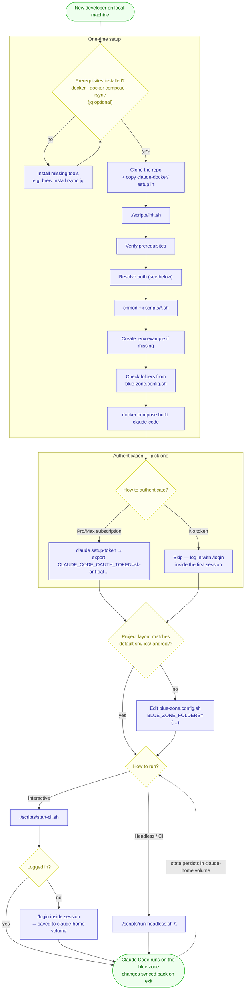

# Local Dev Setup Flow

What a new developer does on their own machine to get the blue-zone Claude Code
environment running for the first time. One-time setup is `./scripts/init.sh`;
after that, day-to-day use is a single `start-cli.sh` / `run-headless.sh` call.

## Steps

| # | Step | Command / file | Notes |
|---|------|----------------|-------|
| 1 | **Install prerequisites** | `docker`, `docker compose`, `rsync`; `jq` optional | `init.sh` checks these and stops if a required one is missing. |
| 2 | **Get the setup** | clone the repo with the `claude-docker/` scripts | The scripts, `blue-zone.config.sh` and compose files live alongside your project. |
| 3 | **Run init** | `./scripts/init.sh` | Verifies tools, resolves auth, marks scripts executable, seeds `.env.example`, lists the configured blue-zone folders, and builds the image. |
| 4 | **Authenticate** | subscription token **or** `/login` | A token is optional — with none, just start a session and log in on the spot. |
| 5 | **Adapt to your project** (optional) | `blue-zone.config.sh` → `BLUE_ZONE_FOLDERS` | Only if your top-level folders differ from `src/ios/android`. See [blue-zone-flow.md](blue-zone-flow.md). |
| 6 | **Run a session** | `./scripts/start-cli.sh` or `./scripts/run-headless.sh "…"` | Each run prepares + validates the blue zone, mounts it, and syncs changes back on exit. |

## Auth & state persist after the first run

The container's home directory lives in the `claude-home` Docker volume, so
login credentials, onboarding answers, and session history **survive between
runs** — you go through login and Claude's setup exactly once. Later interactive
*and* headless runs reuse it. Wipe it with `./scripts/start-cli.sh --clear`.
